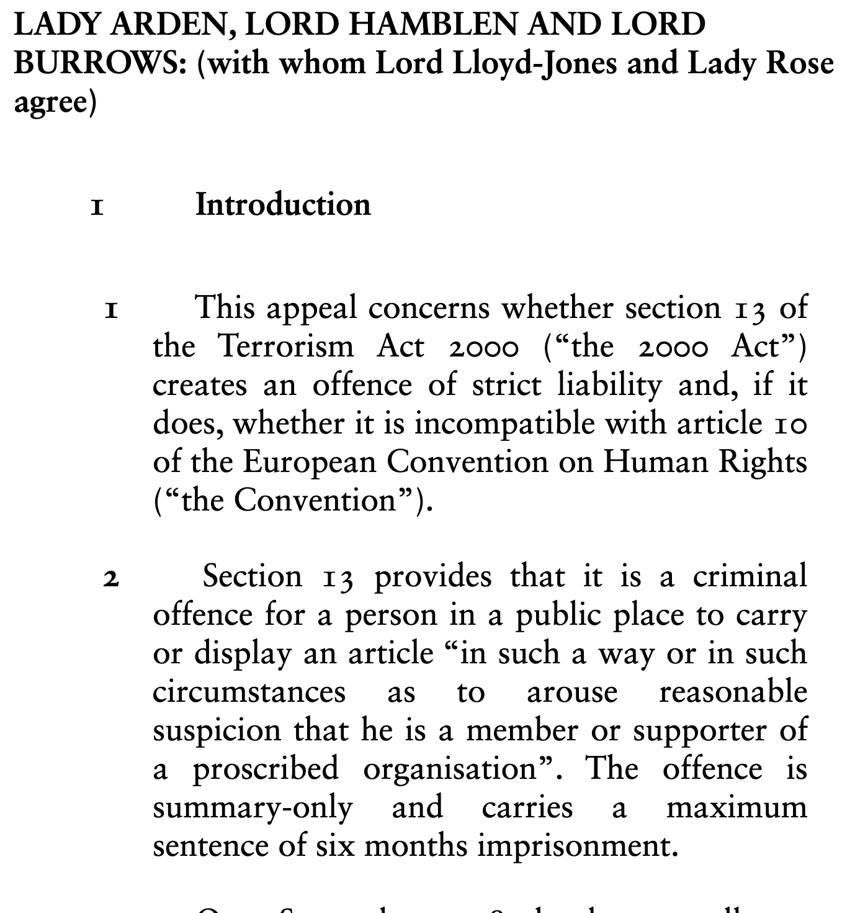

# prettier-uksc
An extension to make BAILII pretty again (and thus undo the UK Supreme Court’s vandalism of its own judgments), by removing Calibri in favour of serif typefaces, justification, and text-figures.  Brought to you by the [Legal Style Blog](https://www.legalstyle.co.uk/).
## Releases
The official release can be downloaded for Chrome users on  the [Chrome Webstore](https://chrome.google.com/webstore/detail/prettier-uksc/fmoeaeaikfmihnpkdabidknamagnkhcg) and for Firefox users  on the [Firefox Add-On](https://addons.mozilla.org/en-US/firefox/addon/prettier-uksc/) store. Users of either browser are strongly recommended to install from these official sources.  Users of Chromium browsers wishing to install it can download the source in the Releases page.  If there is demand, versions may be in future submitted to other browsers’ extension/add-on stores; a Safari version is desirable but will take time to develop.
## Sample

## Licence
This software is free and open-source software licensed under the MIT Licence.
## Disclaimer
This extension is not affiliated with or endorsed by the UK Supreme Court (or any other court or tribunal), nor by or with BAILII.
